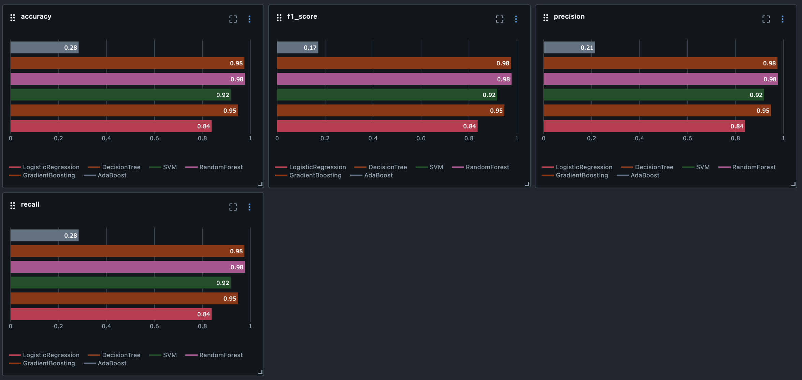

# Hand Gesture Recognition using MediaPipe Landmarks & Classical ML Models

This project builds a hand gesture recognition system that classifies hand signs based on MediaPipe hand landmarks. The pipeline covers preprocessing, model training, evaluation, and experiment tracking using MLflow.

## Dataset

The dataset contains 21 hand landmarks extracted from video frames for multiple hand gestures. Each data sample includes:

- 21 (x, y) coordinate pairs (optionally z),
- A gesture label (string) per row.

## Preprocessing

Landmarks are normalized:

- The **wrist point** is used as the origin.
- Scaling is done based on the **distance to the middle finger tip**.

Labels are encoded using `LabelEncoder` for model compatibility.

## Models Trained

The following classifiers were trained and evaluated:

- Logistic Regression
- Decision Tree
- SVM
- Random Forest
- Gradient Boosting
- AdaBoost

## Evaluation Metrics

Each model was evaluated using:

- **Accuracy**
- **F1-Score**
- **Precision**
- **Recall**

All metrics are tracked via [MLflow](https://mlflow.org/).

### Sample MLflow Metrics Overview:

| Model              | Accuracy | F1-Score | Precision | Recall   |
| ------------------ | -------- | -------- | --------- | -------- |
| RandomForest       | **0.98** | **0.98** | **0.98**  | **0.98** |
| GradientBoosting   | 0.98     | 0.98     | 0.98      | 0.98     |
| DecisionTree       | 0.95     | 0.95     | 0.95      | 0.95     |
| SVM                | 0.92     | 0.92     | 0.92      | 0.92     |
| LogisticRegression | 0.84     | 0.84     | 0.84      | 0.84     |
| AdaBoost           | 0.28     | 0.17     | 0.21      | _low_    |

📌 _Random Forest_ and _Gradient Boosting_ achieved the highest performance.

> _Note: Chart taken directly from MLflow UI comparing key metrics._

## 📦 Artifacts

Saved for deployment:

- `rf_model.pkl`: Trained Random Forest model
- `label_encoder.pkl`: Used to map labels to integers
- Model input/output signature (via `mlflow.models.signature.infer_signature`)
- Logged to MLflow for reproducibility
